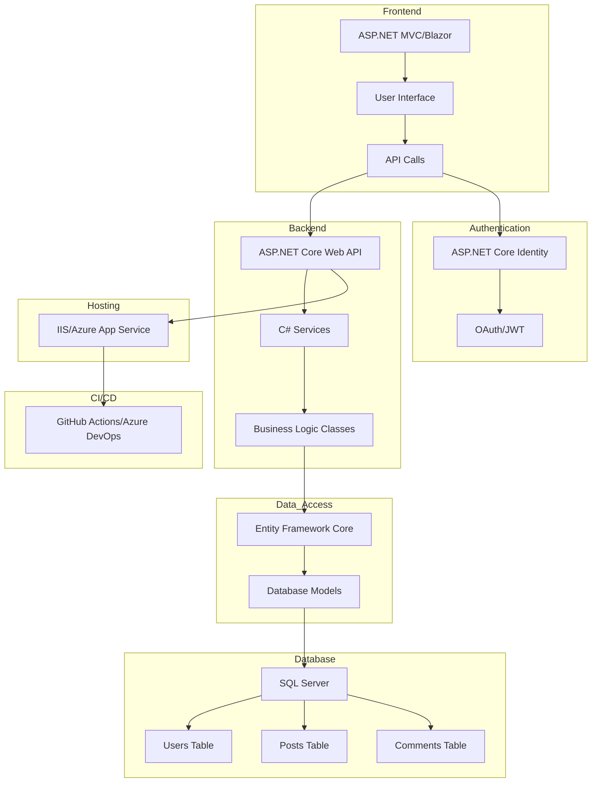

# Blog App Architecture

```mermaid
graph TD;
    subgraph Frontend
        A[ASP.NET MVC/Blazor] --> B[User Interface]
        B --> C[API Calls]
    end

    subgraph Backend
        C --> D[ASP.NET Core Web API]
        D --> E[C# Services]
        E --> F[Business Logic Classes]
    end

    subgraph Data_Access
        F --> G[Entity Framework Core]
        G --> H[Database Models]
    end

    subgraph Database
        H --> I[SQL Server]
        I --> J[Users Table]
        I --> K[Posts Table]
        I --> L[Comments Table]
    end

    subgraph Authentication
        C --> M[ASP.NET Core Identity]
        M --> N[OAuth/JWT]
    end

    subgraph Hosting
        D --> O[IIS/Azure App Service]
    end

    subgraph CI/CD
        O --> P[GitHub Actions/Azure DevOps]
    end
```
