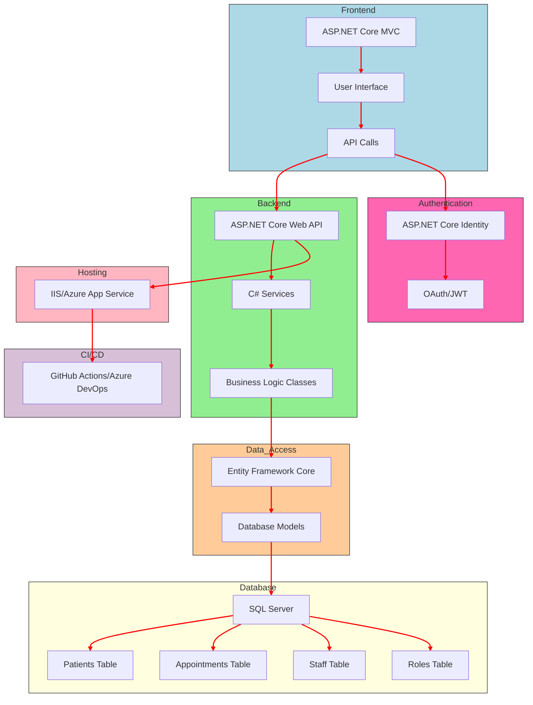

# Dentist Appointment System Architecture

```mermaid
graph TD;
    subgraph Frontend
        A[ASP.NET Core MVC] --> B[User Interface]
        B --> C[API Calls]
    end

    subgraph Backend
        C --> D[ASP.NET Core Web API]
        D --> E[C# Services]
        E --> F[Business Logic Classes]
    end

    subgraph Data_Access
        F --> G[Entity Framework Core]
        G --> H[Database Models]
    end

    subgraph Database
        H --> I[SQL Server]
        I --> J[Patients Table]
        I --> K[Appointments Table]
        I --> L[Staff Table]
        I --> M[Roles Table]
    end

    subgraph Authentication
        C --> N[ASP.NET Core Identity]
        N --> O[OAuth/JWT]
    end

    subgraph Hosting
        D --> P[IIS/Azure App Service]
    end

    subgraph CI/CD
        P --> Q[GitHub Actions/Azure DevOps]
    end

    %% Define link styles
    linkStyle default stroke:#ff0000, stroke-width:2px;

    %% Define section colours
    classDef frontend fill:#add8e6,stroke:#333,stroke-width:2px;    %% light blue
    classDef backend fill:#90ee90,stroke:#333,stroke-width:2px;     %% light green
    classDef data_access fill:#ffcc99,stroke:#333,stroke-width:2px;  %% light orange
    classDef database fill:#ffffe0,stroke:#333,stroke-width:2px;     %% yellow
    classDef authentication fill:#ff66b2,stroke:#333,stroke-width:2px; %% rose
    classDef hosting fill:#ffb6c1,stroke:#333,stroke-width:2px;      %% light pink
    classDef ci_cd fill:#d8bfd8,stroke:#333,stroke-width:2px;        %% light purple

    class Frontend frontend;
    class Backend backend;
    class Data_Access data_access;
    class Database database;
    class Authentication authentication;
    class Hosting hosting;
    class CI/CD ci_cd;
```
